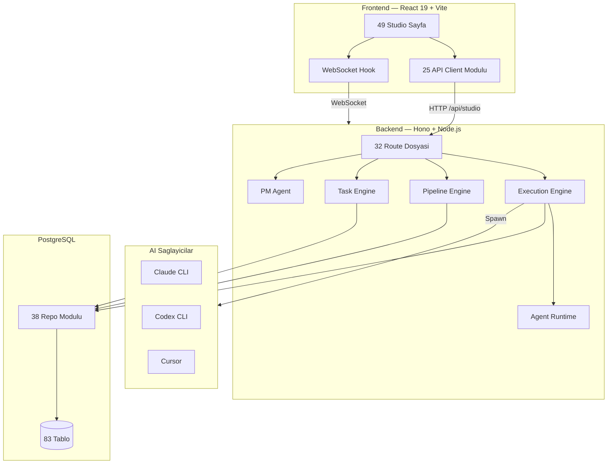
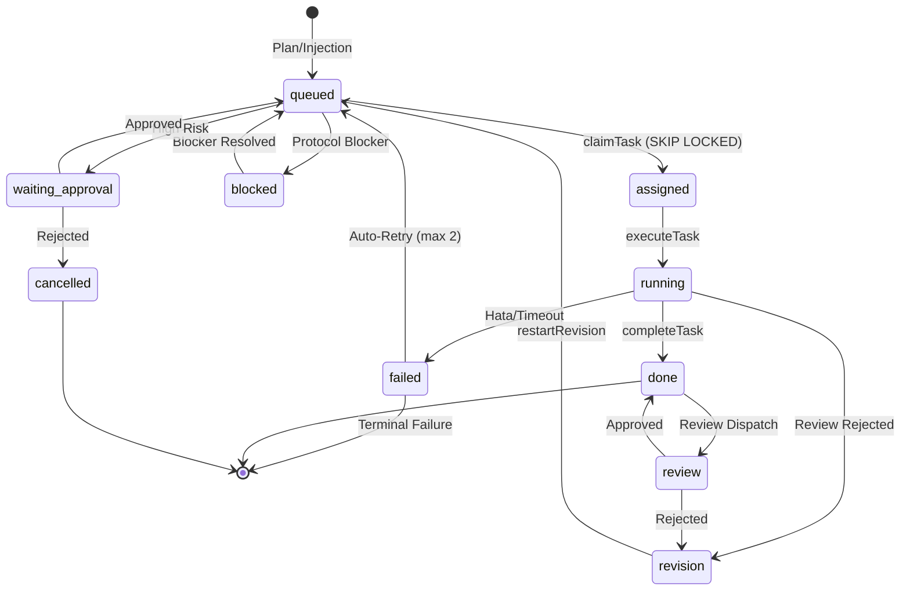
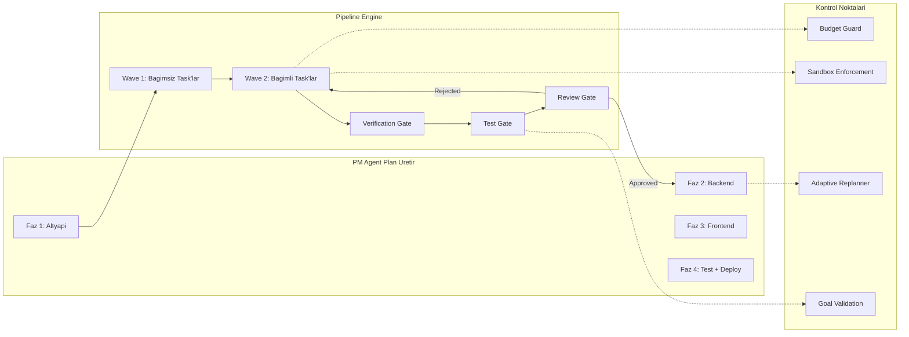
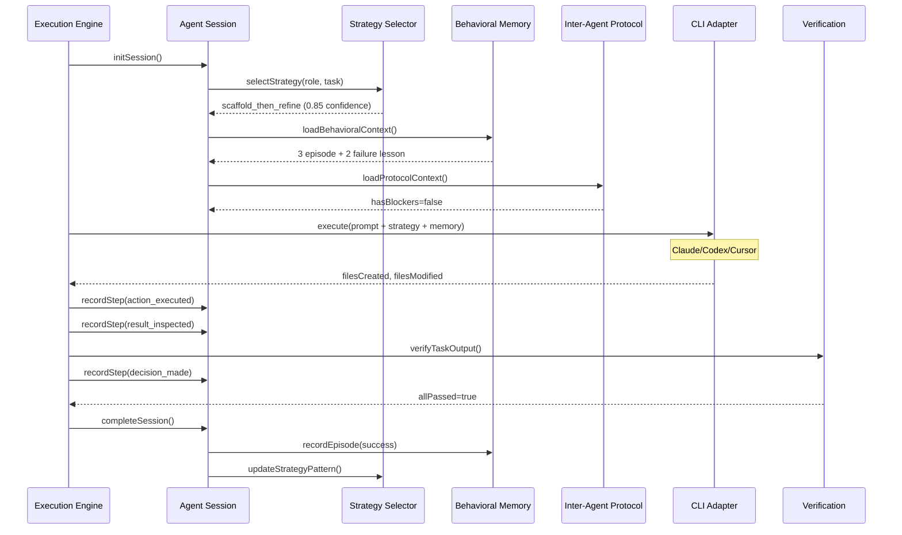
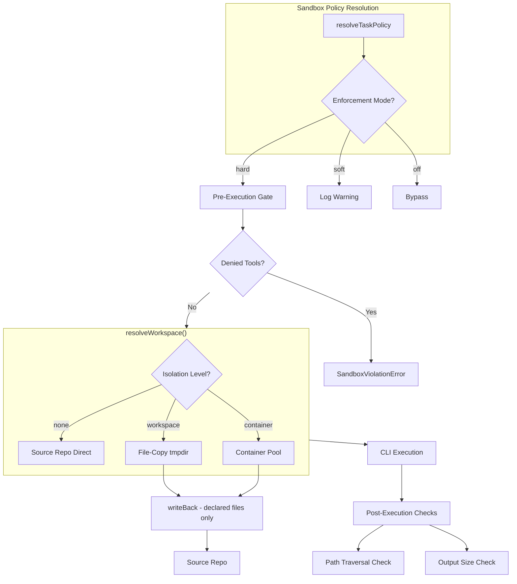
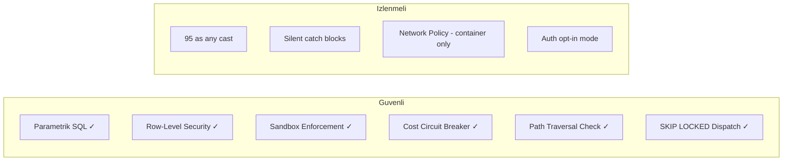
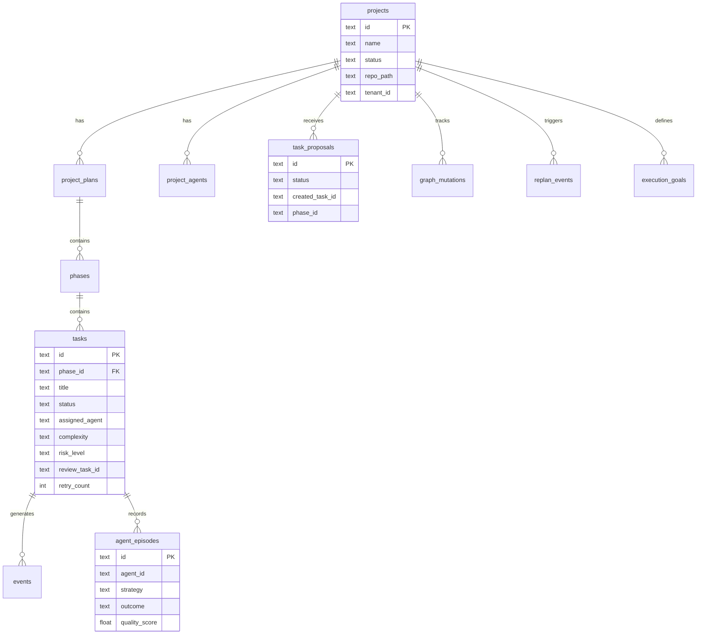
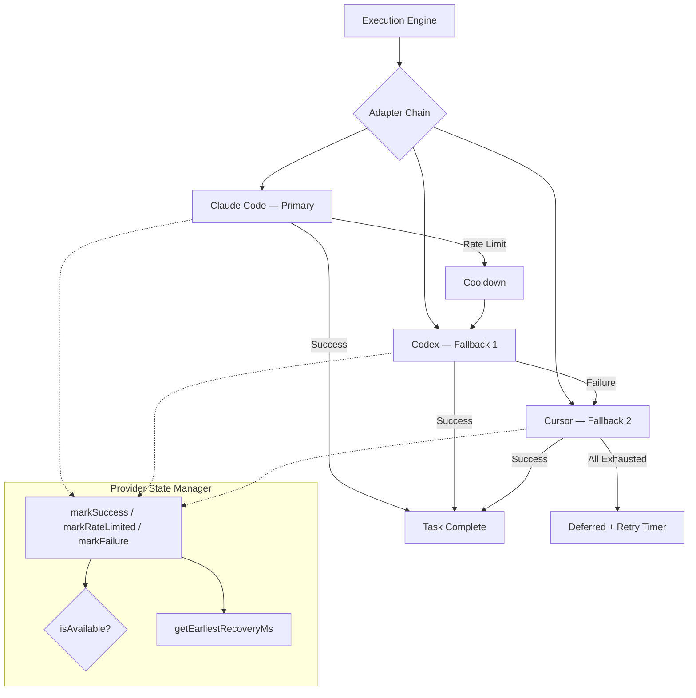
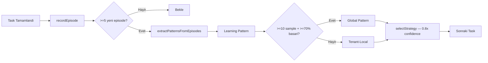

# Oscorpex v8.0 — Proje Analiz Raporu

> Tarih: 2026-04-21 | Branch: master (`82fd8e9`) | Analiz: Derinlemesine

---

## 1. Proje Genel Bakis

Oscorpex, kullanicinin bir fikir tanimlamasiyla 12 AI ajandan olusan bir Scrum takiminin yazilim uretmesini saglayan otonom gelistirme platformudur.

| Metrik | Deger |
|--------|-------|
| Backend TS Dosyasi | 176 (test haric) |
| Backend LOC | 47,058 |
| Frontend TS/TSX Dosyasi | 147 |
| Frontend LOC | 41,593 |
| **Toplam LOC** | **~89,000** |
| Backend Test | 1,087 (5 skip) |
| Frontend Test | 541 |
| **Toplam Test** | **1,628** |
| Route Dosyasi (7,666 LOC) | 32 |
| DB Repo Dosyasi (7,733 LOC) | 38 |
| DB Tablo | 82 |
| Export Edilen Tip/Interface | 94 |
| Studio Sayfa | 57 |
| API Client Dosyasi | 25 |
| Shared Component | 13 |
| Custom Hook | 5 |
| Event Type | 67 |
| Agent Runtime Modul | 7 |

---

## 2. Sistem Mimarisi

---

## 3. Task Yasam Dongusu

Bir task'in olusturulmasindan tamamlanmasina kadar gectigi tum asamalar:

---

## 4. Pipeline DAG Akisi

Pipeline Engine, Kahn algoritmasi ile fazlari wave'ler halinde calistirir:

---

## 5. Agentic Runtime Katmani

Her task calistirilirken ajan runtime'i su adimlari izler:

---

## 6. Sandbox ve Izolasyon Modeli

---

## 7. Dosya Buyukluk Analizi

En buyuk 10 dosya (karmasiklik riski):

| Dosya | LOC | Risk |
|-------|-----|------|
| execution-engine.ts | 1,944 | Yuksek — ana orkestrasyon |
| cli-usage.ts | 1,657 | Orta — OAuth/quota probe |
| task-engine.ts | 1,293 | Yuksek — task lifecycle |
| routes/project-routes.ts | 1,290 | Orta — REST endpoint yiginmasi |
| pipeline-engine.ts | 1,097 | Yuksek — DAG orkestrasyon |
| pm-agent.ts | 1,048 | Orta — AI planlama |
| app-runner.ts | 969 | Dusuk — uygulama baslatma |
| types.ts | 888 | Dusuk — tip tanimlari |
| runtime-analyzer.ts | 856 | Dusuk — framework detection |
| cli-runtime.ts | 762 | Orta — CLI process spawn |

---

## 8. Kod Kalitesi Metrikleri

| Metrik | Deger | Degerlendirme |
|--------|-------|---------------|
| `as any` kullanimi | 64 | Orta — cogu DB row mapping ve route handler |
| Silent catch bloklari | 248 | Yuksek — fire-and-forget `.catch(() => {})` pattern'i |
| `console.*` (production) | 356 | Orta — structured logging'e gecilmeli |
| TODO/FIXME/HACK | 1 | Cok iyi (notification-service.ts:62) |
| SQL Injection riski | 0 | Temiz — tum sorgular $1 parametrik |
| Hardcoded Secret | 0 | Temiz (JWT dev default haric) |
| TypeCheck | Temiz | Hata yok |
| Circular Dependency | 0 | Temiz |
| Biome Lint | Yapilandirilmis | Tab, 120 char, noExplicitAny: warn |
| Test Coverage | 1,628 test | Guclu |

---

## 9. Guvenlik Degerlendirmesi

| Alan | Durum | Detay |
|------|-------|-------|
| SQL Injection | Guvenli | Tum sorgular parametrik ($1, $2...) |
| XSS | Guvenli | React DOM escaping |
| Task Dispatch Race | Guvenli | SELECT FOR UPDATE SKIP LOCKED |
| Path Traversal | Guvenli | isSafeRelativePath + writeBack filter |
| Budget Overflow | Guvenli | enforceBudgetGuard auto-pause |
| Provider Exhaustion | Guvenli | Graceful deferred mode |
| Tenant Isolation | Guvenli | RLS 14+ tablo |
| Network Isolation | Kismi | Container mode'da var, host mode'da yok |
| Auth | Opsiyonel | OSCORPEX_AUTH_ENABLED env ile |

---

## 10. Veritabani Semalari — Temel Tablolar

---

## 11. Multi-Provider Execution

---

## 12. Cross-Project Learning Dongusu

---

## 13. Iyilestirme Onerileri

### Yuksek Oncelik
| # | Oneri | Etki |
|---|-------|------|
| 1 | **execution-engine.ts bolunmeli** (1,944 LOC) | Orkestrasyon, retry, review, proposal isleme ayri dosyalara |
| 2 | **248 silent catch bloku duzeltilmeli** | `.catch(() => {})` yerine `.catch(err => log.warn(...))` — production debug icin kritik |
| 3 | **Structured logging** | 356 console.* yerine pino/winston — severity, correlation ID, JSON format |

### Orta Oncelik
| # | Oneri | Etki |
|---|-------|------|
| 4 | **`as any` azaltma** (64 adet) | Tip guvenligi — graph-coordinator (6), routes (15+), DB repos icin generic helper |
| 5 | project-routes.ts bolunmeli (1,290 LOC) | Execution, pipeline, git, settings ayri route dosyalari |
| 6 | Container pool execution-engine entegrasyonu | resolveWorkspace container branch'i gercek Docker kullansin |
| 7 | **Biome `noExplicitAny: error`** | Warn'dan error'a yukseltilmeli — yeni `as any` girisi engellensin |

### Dusuk Oncelik
| # | Oneri | Etki |
|---|-------|------|
| 8 | cli-usage.ts basitlestirme | 1,657 LOC OAuth probe — kullanilmayan provider'lar cikarilabilir |
| 9 | Event type gruplama | 67 event type tek union'da — namespace'e bolunebilir |
| 10 | OpenAPI spec olusturma | 32 route dosyasi icin swagger/scalar dokumantasyonu |
| 11 | Frontend test coverage artirmali | 541 test / 57 sayfa — daha fazla integration test |

---

## 14. Sonuc

Oscorpex, **~89K LOC** (176 backend + 147 frontend dosya) ve **1,628 test** ile olgun bir AI gelistirme platformudur. v8.0 ile agentic yetenekler (strateji secimi, episodik hafiza, cross-project ogrenme), guvenlik katmani (sandbox enforcement, budget guard, RLS) ve operasyonel kontrol (adaptive replanner, pipeline gate) production-ready seviyeye ulasmistir.

**Guclu Yanlar**: Parametrik SQL (0 injection riski), claim-based dispatch, multi-provider fallback, 82 tablo, 94 tip tanimi, 67 event type, 6 asamali task lifecycle, 32 route modulu, 38 DB repo.

**Gelisim Alanlari**: 248 silent catch bloku (production debug riski), buyuk dosya bolumleme (execution-engine 1,944 LOC), structured logging (356 console.*), 64 `as any` cast azaltma.
