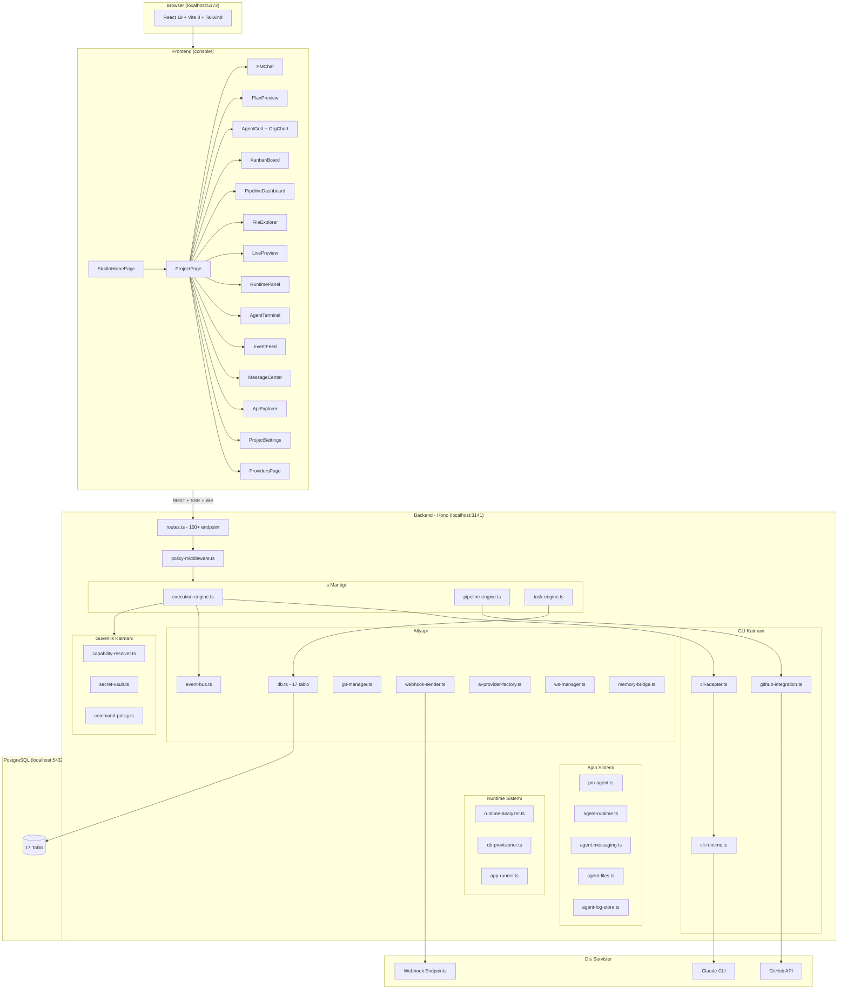
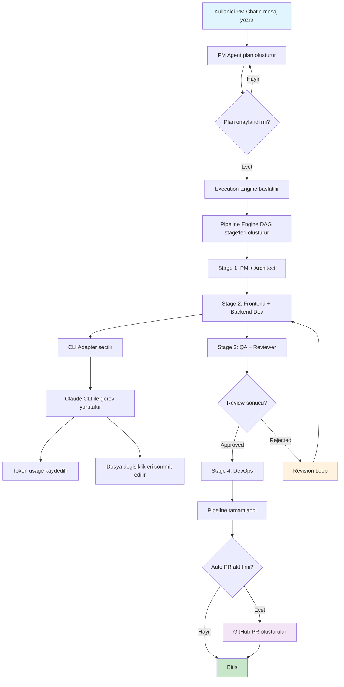
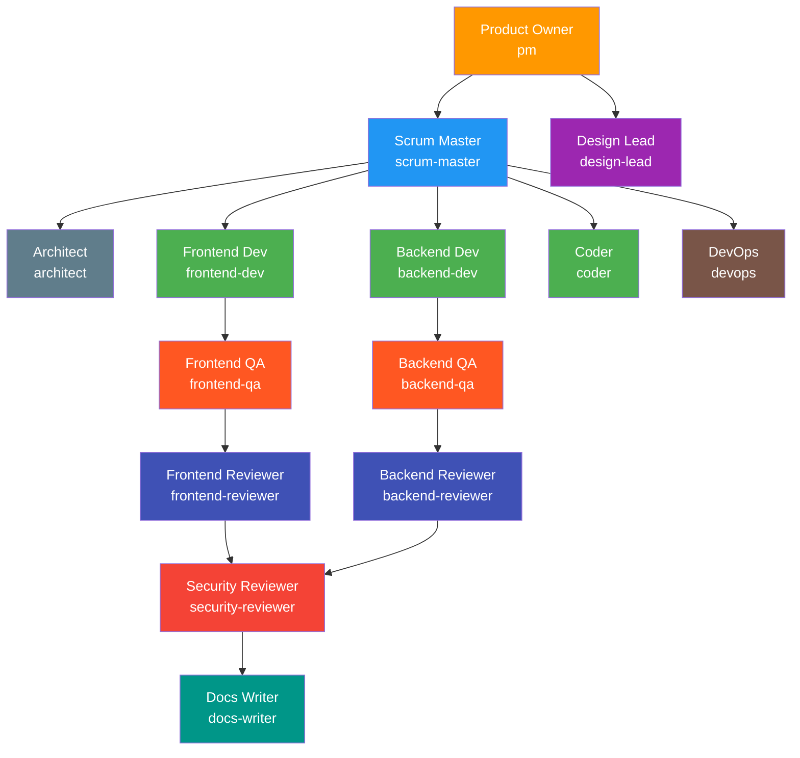
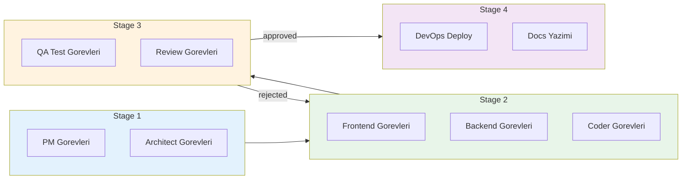
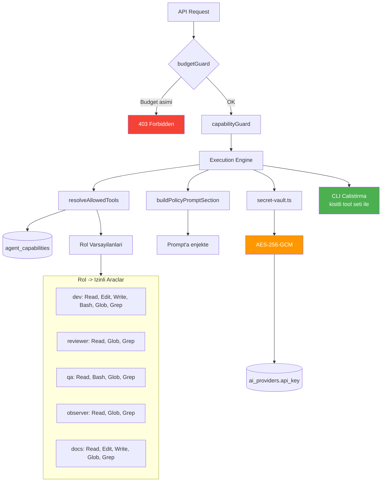
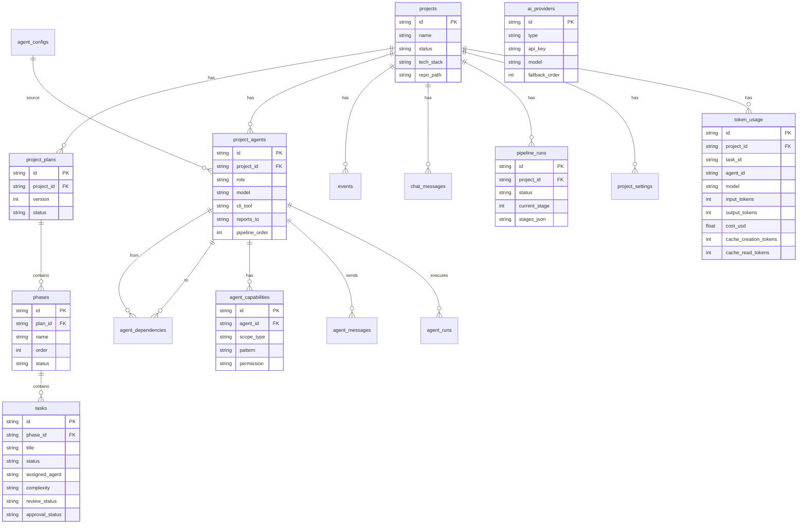
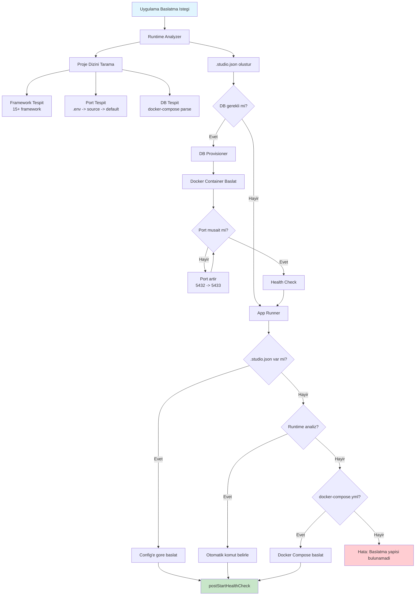
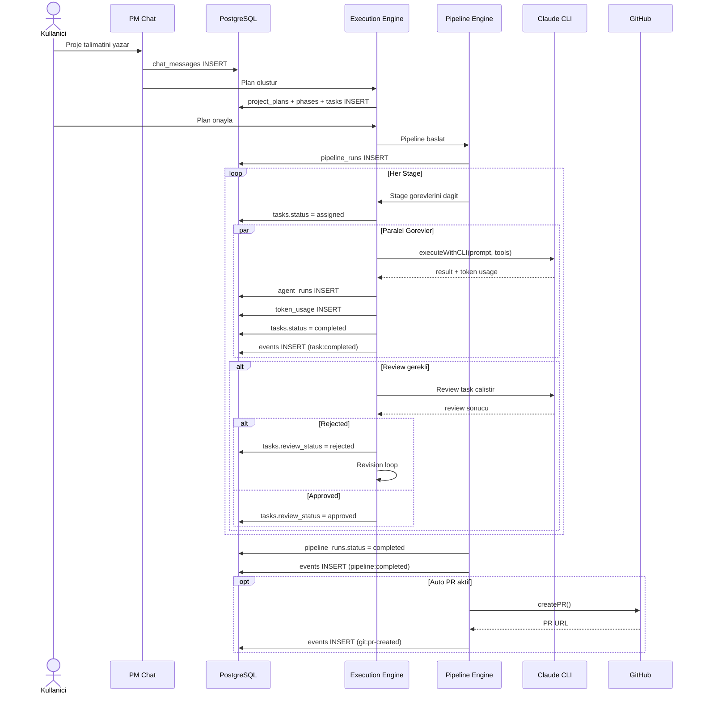
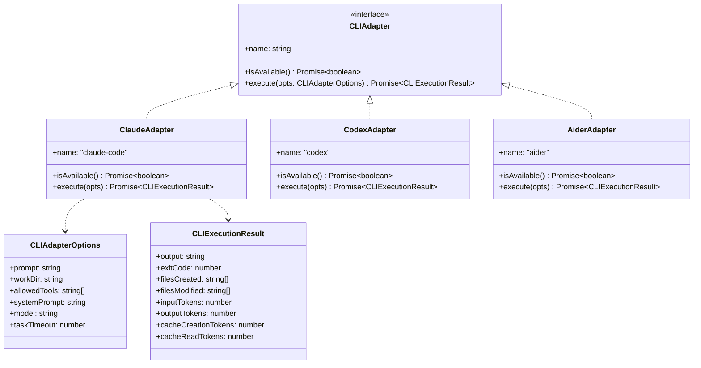
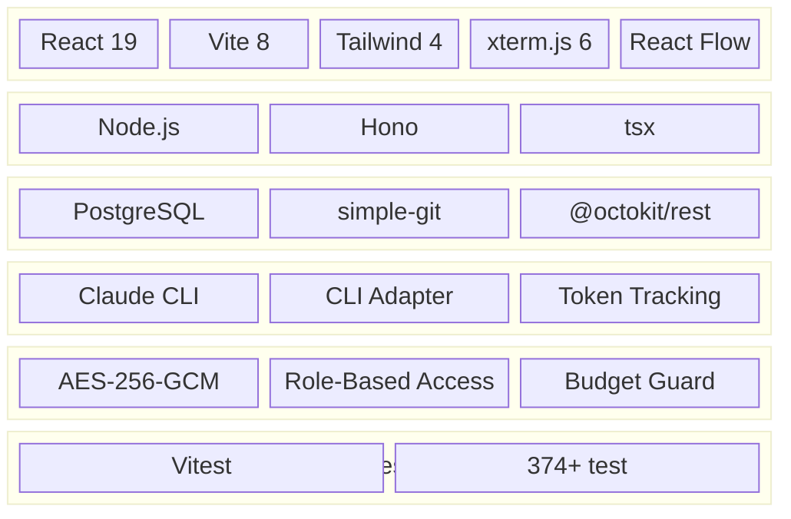

# Oscorpex — Mermaid Mimari Diyagramlari

## 1. Genel Sistem Mimarisi

---

## 2. Yurutme Akisi (Execution Flow)

---

## 3. Ajan Hiyerarsisi (Org Chart)

---

## 4. DAG Pipeline Akisi

---

## 5. Guvenlik Katmani

---

## 6. Veritabani Iliskileri (ER Diyagrami)

---

## 7. Runtime Sistemi

---

## 8. Veri Akisi

---

## 9. Multi-CLI Adapter Pattern

---

## 10. Teknoloji Yigini

