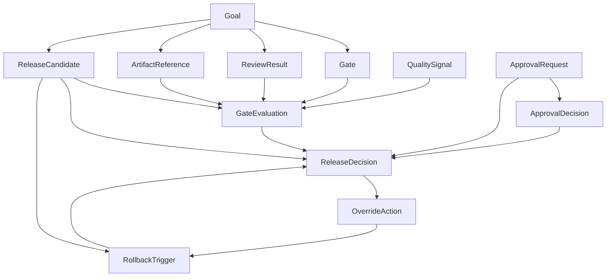

# Quality Gates Center Technical Design

Task ID: H1
Status: design only
Parent scope: P2

## 1. Purpose and Scope

Quality Gates Center is the release decision layer for Oscorpex. It centralizes goal completion validation, gate evaluation, human approval, review rejection handling, release approval, operator override, rollback decisions, artifact evidence, and auditability.

This document is intentionally pre-implementation. It defines state models, decision rules, ownership, blocking behavior, API contracts, and UI ownership boundaries. It does not define database migrations, route implementation, UI implementation, or worker code.

## 2. System Positioning

Quality Gates Center belongs to the Control Plane. Kernel continues to own task execution, pipeline execution, provider runtime, sandbox behavior, cost collection, verification execution, and deployment signals. Quality Gates Center consumes those signals and artifacts, writes decision records, and emits release or rollback decisions for other systems to execute.

| Area | Owner | Rule |
| --- | --- | --- |
| Task execution | Kernel | Quality Gates Center must not mutate task execution tables directly. |
| Provider runtime and policy enforcement | Kernel plus PolicyKit | Quality Gates Center consumes provider policy results as gate signals. |
| Approval records | Control Plane | Quality Gates Center creates and evaluates approval requirements. |
| Audit records | Control Plane | Every gate, approval, release, override, and rollback decision writes append-only audit events. |
| Console UI | Console | UI reads Quality Gates Center projections and sends explicit decision commands. |
| Artifact evidence | Control Plane registry with Kernel-produced artifacts | Missing mandatory artifacts block production release. |

## 3. Design Principles

1. Production release decisions fail closed. Unknown, missing, expired, or stale critical evidence blocks release.
2. Evidence is append-only. Derived projections can be recomputed from gate evaluations, approval decisions, release decisions, override actions, rollback triggers, and artifact references.
3. Human approval is explicit. A role, quorum, SLA, expiration, escalation path, and audit record are required for each approval class.
4. Overrides are exceptional, time-limited, scoped, reasoned, audited, and reviewable.
5. Security and tenant isolation failures are release blockers by default.
6. Rollback rules are part of release design, not an operational afterthought.
7. The decision engine returns structured reasons, not booleans only.

## 4. Roles and Ownership

| Role | Responsibility |
| --- | --- |
| Goal owner | Owns goal intent, acceptance criteria, and final business completion. |
| Task owner | Owns task execution result quality and task-level fixes. |
| Reviewer | Owns standard code or result review acceptance. |
| Security reviewer | Owns security scan interpretation, security approval, and security override review. |
| Release manager | Owns release candidate readiness, production deploy approval, and release closure. |
| Platform operator | Owns incident response, runtime health, operator overrides, and rollback coordination. |
| Provider owner | Owns provider routing, provider policy changes, and provider failure review. |
| Tenant admin | Approves tenant-impacting mutation where tenant policy requires it. |
| Incident commander | Owns incident freeze exceptions and emergency rollback or override coordination. |
| System evaluator | Automated actor that records deterministic gate evaluations from artifacts and signals. |

## 5. Domain Model

### 5.1 Entity Summary

| Entity | Purpose | Primary owner | Lifecycle | Key relations |
| --- | --- | --- | --- | --- |
| Goal | User or platform outcome that must be validated before closure or release. | Goal owner | draft -> planned -> running -> awaiting-review -> review-failed -> awaiting-approval -> approved -> release-ready -> released -> rollback-required -> archived | Has gates, review results, artifacts, release candidates, approvals, quality signals. |
| Gate | Policy-defined check that determines whether a goal or release candidate can advance. | Release manager for release gates, security reviewer for security gates, platform operator for operational gates | draft policy -> active -> deprecated -> retired | Has gate evaluations; maps to quality signals and artifacts. |
| GateEvaluation | Immutable result of evaluating one gate against one scope. | System evaluator or human reviewer | queued -> running -> passed/failed/warned/skipped/expired/superseded | Belongs to gate and goal or release candidate; references quality signals and artifacts. |
| ApprovalRequest | Request for a human or quorum decision. | Requesting system plus required role owner | pending -> in-review -> approved/rejected/expired/superseded/cancelled | Has approval decisions; may be required by gate, release decision, override, rollback. |
| ApprovalDecision | Immutable approve, reject, abstain, or revoke action by an actor. | Approver role holder | recorded -> superseded by newer request, or revoked by explicit action | Belongs to approval request; writes audit event. |
| ReviewResult | Standard review evidence from code, artifact, goal, or execution review. | Reviewer | pending -> accepted/rejected/changes-requested/superseded | Feeds review acceptance gate and may create approval requests. |
| ReleaseCandidate | Immutable release proposal for a goal or set of goals. | Release manager | candidate -> validation-running -> blocked/approved -> deploying -> released/rollback-triggered -> rolled-back/closed | Has gate evaluations, artifacts, release decisions, approvals, rollback triggers. |
| ReleaseDecision | Structured decision produced by the decision engine. | Release manager accountable, system evaluator author for automated decision | draft -> evaluated -> blocked/approved/requires-human-review/requires-rollback/superseded | Belongs to release candidate; references gate evaluations, approvals, artifacts, overrides. |
| OverrideAction | Explicit exception to a blocking or warning decision. | Platform operator, release manager, security reviewer, or incident commander depending gate | requested -> approved -> active -> expired/revoked/closed | References gate evaluation, release decision, approval request, audit event. |
| RollbackTrigger | Signal or human decision that requires or recommends rollback. | Platform operator or system evaluator | detected -> validating -> rollback-required/rollback-recommended/false-positive -> resolved | Belongs to release candidate or released deployment; references incidents, health signals, approvals. |
| QualitySignal | Raw normalized signal from tests, scans, incidents, cost, provider policy, review, deployment health, or audit. | Producer system owner | observed -> normalized -> consumed -> expired | Feeds gate evaluations; may reference artifacts. |
| ArtifactReference | Pointer to immutable evidence used by gates and decisions. | Producer system owner, registry owned by Control Plane | expected -> available -> verified -> stale/missing/invalid -> archived | Referenced by goals, gate evaluations, approvals, release decisions, rollbacks. |

### 5.2 Relation Graph



### 5.3 Scope Keys

Every decision object must carry these keys:

| Field | Requirement |
| --- | --- |
| `tenantId` | Required for all tenant-scoped goals and releases. |
| `goalId` | Required for goal validation and goal-owned release candidates. |
| `releaseCandidateId` | Required for release, deploy, override, and rollback decisions. |
| `policyVersion` | Required for all gate evaluations and release decisions. |
| `correlationId` | Required across evaluations, approvals, overrides, rollbacks, and audit events. |
| `actorId` | Required for human decisions and operator actions. |
| `artifactDigest` | Required when an artifact is used as evidence. |

## 6. State Machine Design

### 6.1 Goal Lifecycle

| State | Meaning | Allowed next states | Entry trigger | Exit/blocking rule |
| --- | --- | --- | --- | --- |
| draft | Goal intent exists but is not planned. | planned, archived | Goal owner creates goal. | Cannot create release candidate. |
| planned | Acceptance criteria and owner are defined. | running, archived | Goal owner approves plan. | Must have owner and acceptance criteria. |
| running | Tasks or pipelines are executing. | awaiting-review, rollback-required, archived | Kernel task execution starts. | Cannot be approved until execution artifacts exist. |
| awaiting-review | Execution is complete and review is required. | review-failed, awaiting-approval, approved | Required review gate is created. | Review acceptance gate must resolve. |
| review-failed | Reviewer rejected or requested changes. | running, archived | ReviewResult is rejected or changes-requested. | Release candidate creation is blocked. |
| awaiting-approval | Required human approval is pending. | approved, review-failed, archived | ApprovalRequest is created. | Approval must be active, non-expired, and quorum-satisfied. |
| approved | Goal completion is approved. | release-ready, archived | Required gates and approvals pass. | Production release still requires release candidate validation. |
| release-ready | Goal has a valid release candidate and all pre-release blockers pass. | released, rollback-required, archived | ReleaseDecision is approved. | Deployment may start only from this state. |
| released | Goal is included in a released candidate. | rollback-required, archived | Deployment health gate passes after release. | Post-release validation must remain passing until closure window ends. |
| rollback-required | Released goal must be reverted or mitigated. | running, archived | RollbackTrigger is rollback-required. | Closure blocked until rollback is completed or incident is resolved. |
| archived | Goal is closed for historical record. | none | Goal owner or system archives after closure. | Terminal state. |

Goal transition constraints:

- `review-failed` always clears previously computed `release-ready` projections for the same goal.
- `awaiting-approval` must reference at least one non-expired ApprovalRequest.
- `release-ready` requires a ReleaseDecision with `decision=approved`.
- `rollback-required` can be entered from `running`, `release-ready`, or `released` when a critical rollback trigger applies.

### 6.2 Approval Lifecycle

| State | Meaning | Allowed next states | Entry trigger | Exit/blocking rule |
| --- | --- | --- | --- | --- |
| pending | Request exists but no reviewer has started. | in-review, approved, rejected, expired, superseded, cancelled | System or actor creates ApprovalRequest. | Pending approval blocks any gate that requires it. |
| in-review | At least one eligible approver opened or acted on request. | approved, rejected, expired, superseded, cancelled | Eligible approver starts review. | Still blocks until quorum is satisfied. |
| approved | Required quorum approved. | superseded | ApprovalDecision quorum reached. | Valid only until expiration or supersession. |
| rejected | Eligible approver or quorum rejected. | superseded | Rejection decision recorded. | Blocks release and moves goal to review-failed when tied to review. |
| expired | SLA or expiration time passed without approval. | superseded | Expiration worker or decision engine marks stale. | Blocks release and requires a new ApprovalRequest. |
| superseded | A newer request replaced this request. | none | Scope, artifact, policy, or release candidate changed. | Terminal for old request. |
| cancelled | Request is withdrawn. | none | Requesting owner cancels before decision. | Terminal; release remains blocked if approval class is still required. |

Approval transition constraints:

- Approval cannot move from `rejected` to `approved`; a new superseding request is required.
- Approval cannot be valid if its referenced artifact or policy version was superseded.
- Approval expiration is evaluated at decision time; expired approvals are treated as absent.

### 6.3 Release Lifecycle

| State | Meaning | Allowed next states | Entry trigger | Exit/blocking rule |
| --- | --- | --- | --- | --- |
| candidate | Release proposal exists. | validation-running, closed | Release manager creates release candidate. | Must reference at least one approved goal. |
| validation-running | Gate evaluations are being computed. | blocked, approved, rollback-triggered | Evaluation starts. | Deployment cannot start. |
| blocked | One or more blocking gates failed or required evidence is missing. | validation-running, closed | ReleaseDecision is blocked. | Requires fix, new artifact, approval, or valid override. |
| approved | All blockers pass and required approvals are valid. | deploying, validation-running, closed | ReleaseDecision is approved. | Approval expires if deploy does not start before deploy window ends. |
| deploying | Deployment is in progress. | released, rollback-triggered | Deployment starts. | New blocking rollback trigger stops deployment. |
| released | Deployment completed and post-release health checks pass. | rollback-triggered, closed | Deployment health gate passes. | Closure waits for post-release validation window. |
| rollback-triggered | Rollback trigger is active. | rolled-back, validation-running, closed | RollbackTrigger requires rollback. | New releases are blocked for the candidate. |
| rolled-back | Rollback or mitigation completed. | closed, validation-running | Rollback execution evidence is verified. | Candidate cannot be marked released. |
| closed | Candidate is no longer active. | none | Release manager closes candidate after release or rollback. | Terminal state. |

Release transition constraints:

- `candidate -> approved` is not allowed without `validation-running`.
- `blocked -> approved` requires a new ReleaseDecision after failed gates are resolved or overridden.
- `deploying -> released` requires deployment health check gate pass.
- `rollback-triggered` is allowed from `validation-running`, `approved`, `deploying`, or `released`.

## 7. Gate Taxonomy

The table defines production release behavior. Non-production environments may evaluate the same gates as warnings only when explicitly configured by environment policy, except audit trail completeness and tenant isolation signals, which remain blocking in all environments.

| Gate type | Required for production? | Blocking? | Auto-evaluated? | Human-reviewed? | Override allowed? | Who can override? | Rule |
| --- | --- | --- | --- | --- | --- | --- | --- |
| typecheck | Yes | Yes | Yes | No | Yes | Release manager | Failed typecheck blocks release. Override allowed only for doc-only or non-runtime artifact releases. |
| test coverage | Yes | Yes | Yes | Optional | Yes | Release manager plus goal owner | Below configured threshold blocks. Override requires reason and follow-up task. |
| lint | Yes | Yes | Yes | No | Yes | Release manager | Failed lint blocks unless affected files are generated artifacts marked non-runtime. |
| security scan | Yes | Yes | Yes | Yes for high/critical | Restricted | Security reviewer plus release manager | High or critical findings block. Override allowed only for accepted false positive or emergency mitigation with expiration. |
| provider policy compliance | Yes | Yes | Yes | Yes for deny or restricted | Restricted | Provider owner plus release manager | Provider policy `deny` blocks. Restricted policy requires approval. |
| review acceptance | Yes | Yes | No | Yes | No | None | Rejected review blocks. New review result is required. |
| human approval | Yes when policy requires | Yes | No | Yes | No | None | Missing, expired, or rejected approval blocks. |
| artifact completeness | Yes | Yes | Yes | Optional | Restricted | Release manager | Missing mandatory artifact blocks. Override is not allowed for rollback plan, audit evidence, or approval evidence. |
| cost threshold | Yes | Yes above hard cap, warning above soft cap | Yes | Optional | Yes | Platform operator plus release manager | Hard cap breach blocks. Soft cap requires acknowledgement. |
| rollback safety check | Yes | Yes | Yes | Optional | Restricted | Platform operator plus release manager | Missing rollback plan blocks. Override not allowed for production deploy. |
| deployment health check | Yes for deploy and post-release | Yes | Yes | Optional | No while degraded | None | Failed deployment health blocks promotion and triggers rollback when post-release. |
| incident freeze window | Yes | Yes during P0/P1 freeze | Yes | Yes | Restricted | Incident commander plus release manager | Active freeze blocks release. Emergency override requires incident override approval. |
| tenant compliance | Yes when tenant data or tenant-scoped mutation exists | Yes | Yes | Yes for restricted tenants | Restricted | Tenant admin plus security reviewer | Tenant isolation breach or missing tenant approval blocks. |
| audit trail completeness | Yes | Yes | Yes | No | No | None | Missing audit correlation, actor, policy version, or evidence digest blocks. |

### 7.1 Gate Evaluation Outcomes

| Outcome | Meaning | Release effect |
| --- | --- | --- |
| passed | Gate satisfied current policy. | Does not block. |
| failed | Gate violated current policy. | Blocks if gate is blocking. |
| warned | Gate exceeded warning threshold but not blocking threshold. | Requires acknowledgement when policy says so. |
| skipped | Gate intentionally not applicable. | Allowed only with policy-defined reason. |
| expired | Evidence is too old. | Treated as failed for blocking gates. |
| superseded | New artifact, policy, or candidate replaced this evaluation. | Ignored by current decision. |

## 8. Approval Model

### 8.1 Approval Classes

| Approval class | Required role | Quorum | Single approver enough? | Multi approval required? | SLA | Expiration | Escalation path |
| --- | --- | --- | --- | --- | --- | --- | --- |
| standard review | Reviewer | 1 approval, 0 rejection | Yes | No | 1 business day | 7 days or artifact superseded | Goal owner -> release manager |
| security approval | Security reviewer | 1 security approval for medium, 2 for high/critical | Medium yes, high/critical no | Yes for high/critical | 1 business day | 72 hours or scan superseded | Security lead -> incident commander for emergency |
| production deploy approval | Release manager | 1 release manager approval | Yes | No | 4 business hours | Deploy window end or 24 hours | Platform operator lead |
| provider change approval | Provider owner plus release manager | 2 approvals | No | Yes | 1 business day | 7 days or provider policy superseded | Platform owner |
| policy override approval | Policy owner plus affected domain owner | 2 approvals | No | Yes | 4 business hours | Override expiration, max 24 hours | Incident commander |
| tenant-impacting mutation approval | Tenant admin plus security reviewer | 2 approvals | No | Yes | Tenant contract SLA, default 2 business days | 7 days or artifact superseded | Customer owner -> security lead |
| admin escalation approval | Platform operator lead | 1 approval plus audit reason | Yes | No | 2 business hours | 24 hours | Incident commander |
| incident override approval | Incident commander plus release manager | 2 approvals | No | Yes | 30 minutes during active incident | Incident window end, max 4 hours | Executive on-call or platform owner |
| rollback approval | Platform operator or incident commander | Automatic for critical, 1 approval for manual rollback | Critical automatic; manual yes | No unless tenant-impacting | 15 minutes for critical, 2 hours otherwise | Active incident window | Incident commander |

### 8.2 Approval Validity Rules

- Approval is valid only for the exact `goalId`, `releaseCandidateId`, artifact digests, policy version, and approval class it references.
- Approval is invalid if the release candidate changes after approval.
- Approval is invalid if an approving user loses the required role before release decision evaluation.
- Rejection is final for the request and requires a new superseding request after remediation.
- ApprovalDecision records are immutable. Revocation creates a new decision event and invalidates derived approval validity.

### 8.3 Human Review Triggers

Human review is required when any of these conditions are true:

- Review acceptance gate is missing or rejected.
- Security scan has high or critical finding.
- Provider policy result is `deny` or `restricted`.
- Tenant-impacting mutation is present.
- Cost hard cap is exceeded or soft cap acknowledgement is required.
- Incident freeze window is active and release is requested.
- Any restricted override is requested.
- Rollback trigger requires manual classification.
- Generated deliverable is user-facing and acceptance criteria require owner sign-off.

## 9. Review Rejection Flow

1. Reviewer records ReviewResult as `rejected` or `changes-requested`.
2. Review acceptance gate evaluation becomes `failed`.
3. Goal moves to `review-failed`.
4. Existing release candidates for the goal move to `blocked` on next evaluation.
5. Existing pending approval requests tied to the rejected artifact are `superseded`.
6. Goal owner or task owner remediates by producing new artifacts or task results.
7. Goal returns to `running` or `awaiting-review`.
8. A new ReviewResult is required before approval or release readiness.

Review rejection cannot be overridden. Only a new accepted ReviewResult can clear it.

## 10. Release Decision Engine

### 10.1 Decision Output

Every release decision returns:

| Field | Meaning |
| --- | --- |
| `decision` | `approved`, `blocked`, `requires_human_review`, `requires_rollback`, or `closed`. |
| `allowed` | True only when deployment can start or continue. |
| `blockedReasons` | Structured list of blocking gates, missing artifacts, invalid approvals, or active rollback triggers. |
| `requiredApprovals` | Approval classes still required. |
| `requiredArtifacts` | Missing or invalid artifacts. |
| `overrideOptions` | Explicitly allowed override paths, or empty when non-overridable. |
| `rollbackAction` | `none`, `manual_review`, `automatic_required`, or `already_triggered`. |
| `auditEventIds` | Audit records written during evaluation. |
| `policyVersion` | Policy version used for the decision. |

### 10.2 Pseudo Decision Flow

```text
evaluate_release(release_candidate):
    assert release_candidate.state in [
        "candidate",
        "validation-running",
        "blocked",
        "approved",
        "deploying",
        "released"
    ]

    artifacts = load_required_artifacts(release_candidate)
    approvals = load_valid_approvals(release_candidate)
    signals = load_quality_signals(release_candidate)
    active_overrides = load_active_overrides(release_candidate)
    rollback_triggers = load_active_rollback_triggers(release_candidate)

    write_audit("release_evaluation_started")

    if audit_trail_is_incomplete(release_candidate):
        return blocked("audit_trail_completeness", override_allowed=false)

    if any_required_artifact_missing_or_invalid(artifacts):
        return blocked("artifact_completeness", missing_artifacts)

    gate_results = evaluate_gates(release_candidate, artifacts, approvals, signals)

    if any_rollback_trigger_requires_rollback(rollback_triggers):
        return requires_rollback(rollback_triggers)

    if gate_failed("tenant_compliance", gate_results):
        return blocked("tenant_compliance", override_allowed=false)

    if gate_failed("security_scan", gate_results):
        if security_failure_is_high_or_critical(gate_results):
            return blocked("security_scan", required_approval="security_approval")

    if gate_failed("provider_policy_compliance", gate_results):
        if provider_policy_is_deny(gate_results):
            return blocked("provider_policy_compliance")

    if gate_failed("review_acceptance", gate_results):
        return blocked("review_acceptance", override_allowed=false)

    if required_approval_missing_or_expired(approvals, gate_results):
        return requires_human_review(required_approvals(gate_results))

    if any_blocking_gate_failed_without_active_override(gate_results, active_overrides):
        return blocked(failed_blocking_gates(gate_results))

    if release_candidate.state == "deploying" and gate_failed("deployment_health_check", gate_results):
        return requires_rollback("deployment_health_check")

    return approved(gate_results, approvals, artifacts, active_overrides)
```

### 10.3 Decision Matrix

| Condition | Decision | Goal effect | Release effect |
| --- | --- | --- | --- |
| All required gates pass, approvals valid, artifacts complete | approved | approved or release-ready | approved |
| Blocking gate failed | blocked | awaiting-review or review-failed depending gate | blocked |
| Approval missing or expired | requires_human_review | awaiting-approval | blocked until approved |
| Review rejected | blocked | review-failed | blocked |
| Rollback trigger requires rollback | requires_rollback | rollback-required if released | rollback-triggered |
| Non-overridable gate failed | blocked | no override path | blocked |
| Valid active override covers failed overridable gate | approved or requires_human_review | state follows remaining gates | decision records override reference |

## 11. Override Model

### 11.1 Override Rules

| Rule | Requirement |
| --- | --- |
| Who can override | Only roles listed in gate taxonomy for the failed gate. Actor must have active role at evaluation time. |
| What can be overridden | Typecheck, coverage, lint, soft cost breach, restricted provider policy, some artifact completeness gaps, incident freeze in emergency, and accepted security false positives. |
| What cannot be overridden | Review rejection, audit trail incompleteness, missing production rollback plan, failed deployment health while deploying, confirmed tenant isolation breach, missing approval evidence, revoked approval, and P0 security incident block. |
| Mandatory reason | Required for every override. Empty, generic, or missing reason rejects the override request. |
| Audit log | Required before override becomes active. Audit record includes actor, role, reason, scope, policy version, expiration, affected gates, and evidence references. |
| Time limit | Required. Default max 24 hours; incident override max 4 hours; security false-positive override max 7 days pending scan rule update. |
| Override review | Required for restricted overrides. Security and tenant overrides require post-approval review. |
| Auto-expire | Required. Expired override is ignored by decision engine and release becomes blocked if failure remains. |
| Rollback after override | Required only when post-release validation fails, emergency override expires during deployment, or override scope was violated. |

### 11.2 Override Lifecycle

| State | Meaning | Allowed next states |
| --- | --- | --- |
| requested | Actor requested exception. | approved, rejected, cancelled |
| approved | Required override approval quorum reached. | active, revoked |
| active | Override can be considered by decision engine. | expired, revoked, closed |
| expired | Time window elapsed. | closed |
| revoked | Approver or incident commander removed override. | closed |
| closed | Override is no longer considered. | none |

### 11.3 Override Evaluation

An override is valid only when all conditions hold:

- It references the exact failed gate evaluation.
- It references the exact release candidate and policy version.
- It has a mandatory reason and audit event.
- It is not expired.
- It has required approval quorum.
- It does not attempt to override a non-overridable gate.
- Its scoped risk level matches the current release candidate risk level.

## 12. Rollback Decision Model

### 12.1 Rollback Conditions

| Condition | Automatic or manual? | Required action | Release effect |
| --- | --- | --- | --- |
| Production health degraded above critical threshold | Automatic | Stop deployment or initiate rollback | rollback-triggered |
| Security violation confirmed post-release | Automatic | Rollback or disable affected capability | rollback-triggered |
| Provider failure causing production outage | Manual unless outage is critical | Platform operator classification | rollback-triggered for critical |
| Cost runaway above hard cap | Automatic | Stop costly route, rollback or disable provider | rollback-triggered |
| Critical incident tied to release | Automatic | Incident commander coordinates rollback | rollback-triggered |
| Tenant isolation breach | Automatic | Stop release, isolate tenant impact, rollback | rollback-triggered |
| Approval revoked before closure window ends | Automatic | Stop or rollback if deployed | rollback-triggered |
| Post-release validation failed | Automatic for critical, manual for warning | Rollback or mitigation decision | rollback-triggered or blocked |
| Deployment health check failed during deploy | Automatic | Stop deployment and rollback | rollback-triggered |
| Incident freeze starts after approval but before deploy | Manual review | Re-evaluate release decision | blocked or approved with incident override |

### 12.2 Rollback Trigger Severity

| Severity | Meaning | Decision |
| --- | --- | --- |
| info | Non-blocking observation. | No rollback. |
| warning | Degradation below critical threshold. | Manual review. |
| high | User-impacting or policy-impacting failure. | Rollback recommended; approval required to continue. |
| critical | Security, tenant isolation, production outage, or cost runaway. | Rollback required automatically. |

### 12.3 Rollback Evidence Required

Rollback cannot be closed until these artifacts exist:

- Rollback execution report.
- Deployment or mitigation status.
- Incident notes when tied to incident.
- Post-rollback health result.
- ReleaseDecision showing rollback closure.
- Audit events for actor and automated rollback triggers.

## 13. Artifact Dependency Model

### 13.1 Required Artifacts

| Artifact | Required for production? | Missing blocks release? | Producer | Used by |
| --- | --- | --- | --- | --- |
| test report | Yes | Yes | Kernel or CI | test coverage gate, release decision |
| diff report | Yes | Yes | Kernel, CI, or VCS integration | review, security review, release decision |
| review summary | Yes | Yes | Reviewer or review system | review acceptance gate |
| security result | Yes | Yes | Security scanner | security scan gate |
| deployment plan | Yes | Yes | Release manager or deployment planner | production deploy approval |
| rollback plan | Yes | Yes, non-overridable | Release manager plus platform operator | rollback safety check |
| provider routing report | Yes when provider route changes or provider policy applies | Yes for provider changes | Kernel provider registry or PolicyKit | provider policy compliance |
| approval evidence | Yes when any approval class is required | Yes, non-overridable | Approval Center | human approval gate |
| generated deliverables | Yes when goal output includes generated files or assets | Yes for goal completion | Task execution or artifact registry | goal validation |
| incident notes | Yes when release is linked to active or recent incident | Yes during incident release | Incident feed | incident freeze and rollback gates |

### 13.2 Artifact Validity

ArtifactReference is valid only when:

- It has immutable location or digest.
- It references the producing system and timestamp.
- Its scope matches goal, release candidate, tenant, and policy version.
- It has not been superseded by newer execution, review, scan, or deployment output.
- It is available to the evaluator at decision time.

If a mandatory artifact is missing, stale, invalid, or superseded, the release decision is `blocked`. The only artifact completeness overrides allowed are for non-runtime generated deliverables or non-production evidence gaps. Production rollback plan, approval evidence, audit evidence, and security result are non-overridable.

## 14. Security and Compliance Gate Rules

Security review is mandatory when any condition is true:

- Production release changes auth, authorization, tenant isolation, sandbox, provider credentials, secrets, payment, audit, approval, rollback, or policy code.
- Security scan reports high or critical severity.
- Provider policy is `deny` or `restricted`.
- A tenant-impacting mutation is included.
- Release requires policy override.
- Artifact includes generated code that will execute in production.
- Incident override is requested during a security or tenant incident.

Tenant compliance is mandatory when:

- The release affects tenant-scoped data.
- The release changes tenant isolation, retention, export, import, billing, or permission behavior.
- A tenant contract marks the tenant as restricted.
- Tenant admin approval is required by policy.

Audit trail completeness is mandatory for every environment. Missing actor, correlation ID, policy version, artifact digest, decision reason, or approval reference blocks release.

## 15. API Contract Draft

All routes are mounted under `/api/studio`. Response bodies use camelCase API fields. Persisted rows may remain snake_case according to existing Control Plane conventions.

### 15.1 Quality Gates

#### GET `/quality-gates/:goalId`

Returns gate status for a goal.

Response:

```json
{
  "goalId": "goal_123",
  "policyVersion": "qg-2026-04-29",
  "overallStatus": "blocked",
  "gates": [
    {
      "gateId": "gate_security_scan",
      "type": "security_scan",
      "required": true,
      "blocking": true,
      "status": "failed",
      "latestEvaluationId": "eval_123",
      "reasons": ["critical finding present"]
    }
  ],
  "requiredApprovals": ["security_approval"],
  "missingArtifacts": []
}
```

#### POST `/quality-gates/evaluate`

Evaluates gates for a goal or release candidate.

Request:

```json
{
  "goalId": "goal_123",
  "releaseCandidateId": "rc_123",
  "scope": "release",
  "policyVersion": "qg-2026-04-29",
  "correlationId": "corr_123"
}
```

Response:

```json
{
  "evaluationBatchId": "batch_123",
  "status": "completed",
  "overallStatus": "blocked",
  "gateEvaluations": [
    {
      "gateEvaluationId": "eval_123",
      "gateType": "artifact_completeness",
      "outcome": "failed",
      "blocking": true
    }
  ]
}
```

#### GET `/quality-gates/:goalId/evaluations`

Returns immutable evaluation history for a goal.

Query parameters:

- `releaseCandidateId`
- `gateType`
- `includeSuperseded`

### 15.2 Approvals

#### POST `/approvals/request`

Creates an approval request.

Request:

```json
{
  "approvalClass": "production_deploy_approval",
  "goalId": "goal_123",
  "releaseCandidateId": "rc_123",
  "requiredRoles": ["release_manager"],
  "artifactRefs": ["artifact_deployment_plan"],
  "expiresAt": "2026-04-30T12:00:00.000Z",
  "reason": "Production deploy approval required for rc_123"
}
```

Response:

```json
{
  "approvalRequestId": "approval_123",
  "state": "pending",
  "requiredQuorum": 1,
  "expiresAt": "2026-04-30T12:00:00.000Z"
}
```

#### POST `/approvals/:id/approve`

Records an approval decision.

Request:

```json
{
  "actorId": "user_123",
  "decisionReason": "Reviewed gate evidence and deployment plan.",
  "correlationId": "corr_123"
}
```

Response:

```json
{
  "approvalRequestId": "approval_123",
  "state": "approved",
  "decisionId": "approval_decision_123"
}
```

#### POST `/approvals/:id/reject`

Records a rejection decision.

Request:

```json
{
  "actorId": "user_123",
  "decisionReason": "Security finding is unresolved.",
  "correlationId": "corr_123"
}
```

Response:

```json
{
  "approvalRequestId": "approval_123",
  "state": "rejected",
  "decisionId": "approval_decision_124",
  "releaseEffect": "blocked"
}
```

### 15.3 Release Candidates and Decisions

#### POST `/release-candidates/create`

Creates an immutable release candidate.

Request:

```json
{
  "goalIds": ["goal_123"],
  "targetEnvironment": "production",
  "artifactRefs": ["artifact_test_report", "artifact_diff_report"],
  "requestedBy": "user_123",
  "correlationId": "corr_123"
}
```

Response:

```json
{
  "releaseCandidateId": "rc_123",
  "state": "candidate",
  "requiredArtifacts": ["test_report", "diff_report", "security_result", "deployment_plan", "rollback_plan"]
}
```

#### POST `/release/:id/decision`

Runs the release decision engine for a candidate.

Request:

```json
{
  "requestedBy": "user_123",
  "policyVersion": "qg-2026-04-29",
  "correlationId": "corr_123"
}
```

Response:

```json
{
  "releaseCandidateId": "rc_123",
  "decision": "blocked",
  "allowed": false,
  "blockedReasons": [
    {
      "gateType": "security_scan",
      "reason": "critical finding present",
      "overrideAllowed": false
    }
  ],
  "requiredApprovals": ["security_approval"],
  "rollbackAction": "none"
}
```

#### POST `/release/:id/override`

Requests or activates an override for an overridable blocker.

Request:

```json
{
  "gateEvaluationId": "eval_123",
  "overrideClass": "incident_override",
  "requestedBy": "user_123",
  "reason": "Emergency release during incident to restore service.",
  "expiresAt": "2026-04-29T18:00:00.000Z",
  "correlationId": "corr_123"
}
```

Response:

```json
{
  "overrideActionId": "override_123",
  "state": "requested",
  "requiredApprovals": ["incident_override_approval"]
}
```

#### POST `/release/:id/rollback`

Creates or executes rollback decision.

Request:

```json
{
  "triggerId": "rollback_trigger_123",
  "requestedBy": "system",
  "rollbackMode": "automatic",
  "reason": "Deployment health check failed.",
  "correlationId": "corr_123"
}
```

Response:

```json
{
  "releaseCandidateId": "rc_123",
  "releaseState": "rollback-triggered",
  "rollbackAction": "automatic_required",
  "requiredArtifacts": ["rollback_execution_report", "post_rollback_health_result"]
}
```

### 15.4 Artifacts

#### GET `/artifacts/:goalId`

Returns artifact references for a goal.

Response:

```json
{
  "goalId": "goal_123",
  "artifacts": [
    {
      "artifactId": "artifact_test_report",
      "type": "test_report",
      "status": "verified",
      "digest": "sha256:...",
      "producedBy": "ci",
      "producedAt": "2026-04-29T09:00:00.000Z"
    }
  ],
  "missingRequiredArtifacts": ["rollback_plan"]
}
```

#### POST `/artifacts/register`

Registers an immutable artifact reference.

Request:

```json
{
  "goalId": "goal_123",
  "releaseCandidateId": "rc_123",
  "type": "security_result",
  "location": "s3://artifact-store/security-result.json",
  "digest": "sha256:...",
  "producedBy": "security-scan",
  "correlationId": "corr_123"
}
```

Response:

```json
{
  "artifactId": "artifact_security_result",
  "status": "available"
}
```

## 16. UI Ownership Draft

| UI surface | Owner | Responsibility boundary | Must not do |
| --- | --- | --- | --- |
| Quality Gates Dashboard | Console, data from Control Plane | Show goal and release gate status, blockers, missing artifacts, policy version, and latest evaluations. | Must not compute release decisions client-side. |
| Human Review Inbox | Console, Approval Center | Show pending approvals, required role, SLA, evidence, approve/reject actions. | Must not allow approval when actor lacks required role. |
| Release Decision Panel | Console, Release Manager workflow | Show decision result, blockers, required approvals, release readiness, deploy eligibility. | Must not bypass decision engine. |
| Approval Queue | Console, Approval Center | Filter approvals by role, state, expiration, escalation, and tenant. | Must not merge separate approval classes into one ambiguous action. |
| Artifact Explorer | Console, Artifact Registry | Show required, available, stale, invalid, and missing artifacts with digest and producer. | Must not let mutable artifact content replace immutable reference silently. |
| Rollback Timeline | Console, Incident and Release feeds | Show rollback triggers, health signals, incident notes, rollback actions, closure evidence. | Must not close rollback without required evidence. |
| Operator Override Console | Console, Operator workflow | Request, approve, revoke, and inspect scoped overrides with reason, expiration, and audit. | Must not expose non-overridable gates as override options. |

## 17. Audit Trail

Every state transition and decision writes append-only audit events. Minimum audit fields:

- `eventId`
- `eventType`
- `tenantId`
- `goalId`
- `releaseCandidateId`
- `actorId` or `systemActor`
- `actorRoles`
- `correlationId`
- `policyVersion`
- `previousState`
- `nextState`
- `reason`
- `artifactRefs`
- `gateEvaluationRefs`
- `approvalRefs`
- `overrideRefs`
- `createdAt`

Audit trail completeness gate fails when any mandatory field is missing for a decision that affects release, approval, override, rollback, or goal closure.

## 18. Acceptance Answers

| Question | Decision |
| --- | --- |
| How is release decision made? | ReleaseDecision Engine evaluates mandatory artifacts, current policy version, gate evaluations, valid approvals, active overrides, and rollback triggers. It returns structured `approved`, `blocked`, `requires_human_review`, or `requires_rollback`. |
| Who approves? | Approval class defines the required role and quorum. Standard review uses Reviewer, security uses Security reviewer, production deploy uses Release manager, provider change uses Provider owner plus Release manager, tenant mutation uses Tenant admin plus Security reviewer. |
| Which gates are blockers? | For production, typecheck, test coverage, lint, security scan, provider policy compliance, review acceptance, required human approval, artifact completeness, cost hard cap, rollback safety, deployment health, incident freeze, tenant compliance, and audit trail completeness are blockers according to the gate taxonomy. |
| How does override work? | Override is role-scoped, reasoned, audited, time-limited, approval-backed when restricted, auto-expiring, and ignored if it targets a non-overridable gate or stale evaluation. |
| When is rollback mandatory? | Rollback is mandatory for critical production health degradation, confirmed security violation, cost runaway, critical incident tied to release, tenant isolation breach, revoked approval before closure, deployment health failure, and critical post-release validation failure. |
| What happens if artifact is missing? | Missing mandatory production artifact blocks release. Missing rollback plan, approval evidence, audit evidence, and security result are non-overridable. |
| How is human review triggered? | Human review is triggered by review gates, required approval classes, high/critical security findings, provider restricted/deny policy, tenant-impacting changes, cost threshold breaches, incident freeze overrides, rollback classification, and user-facing generated deliverable sign-off. |
| Where is security review mandatory? | Security review is mandatory for production changes touching auth, authorization, tenant isolation, sandbox, provider credentials, secrets, payment, audit, approval, rollback, policy code, high/critical scan findings, provider policy exceptions, tenant-impacting mutation, policy override, executable generated code, and security incidents. |
| How is audit trail protected? | All decision objects write append-only audit records with actor, correlation, policy version, artifact digest, decision reason, and evidence references. Audit trail completeness is non-overridable and blocking. |

## 19. Follow-up Implementation Tasks

1. Define database schema for gates, gate evaluations, release candidates, release decisions, override actions, rollback triggers, quality signals, and artifact references.
2. Extend Approval Center to support approval classes, quorum, expiration, supersession, and role validation.
3. Implement ReleaseDecision Engine as a Control Plane service with deterministic policy versioning.
4. Add artifact registry APIs and immutable digest validation.
5. Add gate evaluator adapters for typecheck, tests, lint, security, provider policy, cost, incident, tenant compliance, deployment health, and audit trail.
6. Build Console surfaces listed in the UI ownership draft.
7. Add integration tests for blocked release, approval-required release, override path, non-overridable failure, rollback trigger, and missing artifact behavior.

## 20. Final Review Checklist

| Requirement | Status |
| --- | --- |
| No implementation | Satisfied. |
| No vague decisions | Satisfied. |
| No later placeholders | Satisfied. |
| All critical states explicit | Satisfied. |
| All blocking rules explicit | Satisfied. |
| All ownership rules explicit | Satisfied. |
